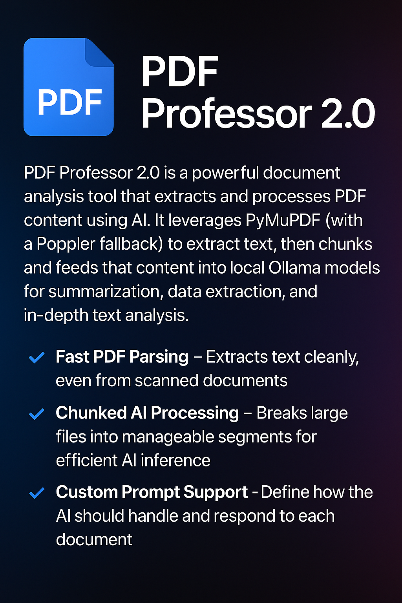

# PDF Professor 2.0

## Overview

**PDF Professor 2.0** is a robust, automated pipeline for extracting, processing, and analyzing text from PDF documents using advanced AI models. Designed for professionals in research, legal, cybersecurity, and investigative domains, PDF Professor streamlines the transformation of unstructured PDF data into actionable, structured intelligence.

---

## Key Features

- **Automated PDF Text Extraction:** Utilizes PyMuPDF for high-fidelity text extraction, with Poppler as a fallback for maximum compatibility.
- **Intelligent Chunking:** Splits large documents into manageable, user-configurable text chunks for efficient processing.
- **AI-Powered Processing:** Integrates with Ollama to process each chunk using state-of-the-art large language models (LLMs) and custom user prompts.
- **Custom Prompt Support:** Accepts dynamic prompts, enabling tailored analysis such as summarization, entity extraction, legal review, or threat intelligence.
- **Progress Logging & Resume:** Maintains a detailed log of processing progress, allowing seamless resumption after interruptions.
- **Concurrent Processing:** Supports multi-threaded execution for efficient handling of multiple documents.
- **Output Management:** Aggregates processed results into comprehensive script files, with optional per-chunk storage for granular review.
- **Model Training Integration:** Optionally sends processed content back to the LLM for incremental training or fine-tuning.

---

## How It Works

1. **Configuration:**
   - All settings (directories, chunk size, model command) are managed in `config.json` for easy customization.
2. **PDF Discovery:**
   - Scans the specified input directory for PDF files.
3. **Progress Tracking:**
   - Loads a progress log to resume processing from the last completed chunk for each PDF.
4. **Text Extraction:**
   - Extracts text from each PDF using PyMuPDF, with Poppler as a fallback.
5. **Chunking:**
   - Splits extracted text into chunks based on the configured size.
6. **AI Processing:**
   - Sends each chunk, along with the user’s prompt, to the selected Ollama LLM for processing.
7. **Logging & Output:**
   - Updates the progress log after each chunk. Aggregates all processed chunks and saves the final output to the `Scripts` directory.
8. **Optional Model Training:**
   - Optionally sends the processed content to the LLM for further training.

---

## Installation & Setup

### 1. Clone the Repository
```bash
git clone https://github.com/gs-ai/PDFProfessor.git
cd PDFProfessor
```

### 2. Set Up Environment
```bash
conda create -n pdfprofessorENV python=3.10
conda activate pdfprofessorENV
```

### 3. Install Dependencies
```bash
pip install -r requirements.txt
```

---

## Configuration

Edit `config.json` to match your environment and preferences:

```json
{
    "pdf_directory": "PDF",
    "output_directory": "Scripts",
    "log_directory": "Logs",
    "chunk_storage_directory": "ProcessedChunks",
    "ollama_command": ["ollama", "run", "wizardlm2:7b"],
    "chunk_size": 2000
}
```

- **pdf_directory:** Directory containing source PDFs.
- **output_directory:** Where final processed scripts are saved.
- **log_directory:** Stores progress logs for resumability.
- **chunk_storage_directory:** (Optional) For saving individual processed chunks.
- **ollama_command:** Command to invoke the desired LLM via Ollama.
- **chunk_size:** Number of characters per chunk.

---

## Usage

### 1. Run the Program
```bash
python pdfprofessor.py
```

### 2. Enter Your Prompt
```
Enter your prompt for Ollama: Summarize key points.
```

### 3. Processing & Output
- The program will process all PDFs in the input directory, chunk by chunk.
- Progress is displayed in real time and logged for resumption.
- Final results are saved in the `Scripts` directory as timestamped script files.

---

## Model Selection & Setup

### Recommended Models
- **WizardLM 2:7B** – Deep text analysis and summarization.
- **DeepSeek-R1:7B** – Legal, technical, and cybersecurity documents.
- **Mistral, LLaMA 3.1** – Fast, general-purpose processing.

### Changing Models
1. Edit `ollama_command` in `config.json` to specify your preferred model.
2. Ensure the model is downloaded locally:
   ```bash
   ollama pull <model-name>
   ```
3. List available models:
   ```bash
   ollama list
   ```
4. Test model performance:
   ```bash
   ollama run <model-name>
   ```

---

## File Structure

```plaintext
PDFProfessor/
├── 80f7bd26-6e6a-4236-abf0-6f1418250f99.png   # Logo
├── pdfprofessor.py                            # Main script
├── config.json                                # Configuration file
├── requirements.txt                           # Dependencies
├── prompt-list.txt                            # Example prompt list
├── prompt-list-OUTSTANDING.txt                # Outstanding prompts
├── PDF/                                       # Source PDFs
├── Logs/                                      # Progress logs
├── ProcessedChunks/                           # (Optional) Per-chunk outputs
└── Scripts/                                   # Final processed scripts
```

---

## Example Prompts

- Summarize the main arguments and conclusions.
- Extract all legal statutes and case law references.
- Identify cybersecurity incident response steps.
- List all named entities and categorize them.
- Convert whistleblower testimonies into structured datasets.

---

## Troubleshooting

- **Timeout Errors:** Increase the timeout in the code or reduce chunk size.
- **Slow Performance:** Lower chunk size or concurrency settings.
- **Model Issues:** Use a smaller or different Ollama model.
- **Resume Support:** If interrupted, simply rerun the program; it will pick up where it left off.

---

## License

This project is licensed under the [MIT License](LICENSE). Contributions are welcome!

---

## Contact & Support

For questions, feature requests, or support, please open an issue on [GitHub](https://github.com/gs-ai/PDFProfessor) or contact the maintainer directly.

